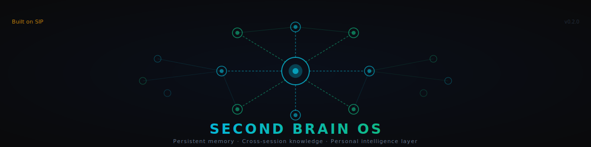

<p align="center">
  
</p>

# Second Brain OS

> A build-in-public AI second-brain template for Obsidian. Two-vault hard privacy separation. Coding-agent-native. Composes the Starlight Intelligence Protocol (SIP).

[](LICENSE)
[](https://github.com/frankxai/Starlight-Intelligence-System)
[](https://github.com/frankxai/second-brain-os/actions/workflows/test.yml)
[](https://www.python.org/downloads/)

**Status:** v0.2.0 — coding-agent-native ingestion.

---

## What this is

A bootable template that gives you a working AI-augmented two-vault Obsidian system. The compute that summarizes your conversations is the coding-agent session you already pay for, not an extra API bill.

- **`brain/` vault** — MCP-wired. Your LLM (Claude Desktop, Claude Code, etc.) reads + writes here. Publishable.
- **`private/` vault** — air-gapped. No MCP server points here. No LLM has access. Sensitive content lives here permanently.
- **Dual-write ingestion** — Claude.ai + ChatGPT exports → raw to `private/`, summary stubs to `brain/_inbox/`.
- **Coding-agent distillation** — `/distill-inbox` in any session (Claude Code, ChatGPT, Cursor, Codex, Gemini) turns stubs into real summaries. No extra API spend.
- **Audit log** — every ingest + distill event written to `private/_distill/audit.jsonl`. Inspectable, never silent.
- **Two starter agents** — `people-map` (per-person index) + `pattern-detector` (weekly pattern surfacing).
- **Paid tier** — 8 depth agents (Big 5, 16P, business-map, decision-history, ikigai, content-engine, …). See [`docs/paid-tier.md`](docs/paid-tier.md).

## 30 minutes to wire. Up to 24 hours to first insight.

The Claude.ai data export has a **24-hour delivery window**. You can wire the entire system in 30 minutes, but you can't ingest until the export email arrives. Plan accordingly.

## Quick start

```bash
git clone https://github.com/frankxai/second-brain-os
cd second-brain-os

# Install the ingestion package
python -m venv .venv && source .venv/bin/activate  # Windows: .venv\Scripts\activate
pip install -e .

# Run setup
pwsh ./scripts/setup.ps1     # Windows
./scripts/setup.sh            # macOS / Linux
```

See [`docs/getting-started.md`](docs/getting-started.md) for the full walkthrough.

## The three modes

`sbo-ingest` has three modes. **Default is `agent` — recommended.**

| Mode | Cost | Compute | When to use |
|---|---|---|---|
| `agent` *(default)* | $0 extra | Your coding-agent session | You have Claude Code / ChatGPT / Cursor / Codex / Gemini open. Best quality (agent cross-references your vault). |
| `api` | ~$0.005/convo on Haiku 4.5 | Anthropic API | Batch automation. No coding-agent session handy. |
| `dry-run` | $0 | None — stubs only | Smoke-test the install. Verify the dual-write boundary. |

### Default (agent mode) — recommended

```bash
sbo-ingest path/to/conversations.jsonl \
  --brain-root /path/to/brain \
  --private-root /path/to/private
# Writes raw to private/, stubs (status: needs-summary) to brain/_inbox/
```

Then in Claude Code (or any other coding agent — see [`docs/cross-ai-portability.md`](docs/cross-ai-portability.md)):

```
/distill-inbox
```

The agent walks every stub, reads the linked raw conversation in `private/`, produces a real summary, writes it back, updates `status: triage`, and logs to `private/_distill/audit.jsonl`. No extra API spend.

### API mode (optional)

```bash
sbo-ingest path/to/conversations.jsonl \
  --brain-root /path/to/brain \
  --private-root /path/to/private \
  --mode api  # or just set $ANTHROPIC_API_KEY
```

### Smoke-test the install

```bash
sbo-ingest tests/fixtures/claude-ai-export-sample.jsonl \
  --brain-root /path/to/brain \
  --private-root /path/to/private \
  --mode dry-run  # legacy --dry-run flag also works
```

## What you get

```
~/second-brain/
├── brain/                 # 10 community plugins, MCP-wired, agent-maintained zones
│   ├── _capture.md
│   ├── _inbox/{claude-ai,chatgpt,manual}/   # status: needs-summary lives here
│   ├── notes/{ideas,learnings,decisions}/
│   ├── projects/
│   ├── people/            # auto-maintained by people-map agent
│   ├── patterns/          # weekly pattern-detector output
│   ├── _meta/             # paid-tier psychometrics, businesses, decisions-history
│   ├── _moc/              # Maps of Content
│   └── _agents/           # agent prompt contracts
└── private/               # air-gapped, no MCP, no LLM
    ├── chat-history/{claude-ai,chatgpt}/    # raw conversations, UUID-named
    ├── journal/
    ├── relationships/
    ├── health/
    ├── finances/
    └── _distill/
        ├── audit.jsonl    # append-only ingest + distill log
        └── pending/       # private patterns awaiting promotion to brain
```

## Docs

| Doc | What |
|---|---|
| [Getting Started](docs/getting-started.md) | 30-min wire walkthrough + Day 1 flow |
| [Ingestion Guide](docs/ingestion-guide.md) | Claude.ai + ChatGPT export workflows + the three modes |
| [Privacy Model](docs/privacy-model.md) | Threat model + privacy-hardening checklist |
| [Architecture](docs/architecture.md) | Three edges, two vaults, agent zones |
| [Composition Guide](docs/composition-guide.md) | Wiring to SIS / Library OS / Chronicle (optional) |
| [Paid Tier](docs/paid-tier.md) | 8 depth agents (Big 5, 16P, business-map, …) |
| [Cross-AI Portability](docs/cross-ai-portability.md) | Running `/distill-inbox` + other commands in ChatGPT / Cursor / Codex / Gemini |

## Privacy

> MCP never has a path to `private/`. The boundary is filesystem, not config.

Coding agents that run `/distill-inbox` read `private/` once per conversation (with your explicit consent the moment you invoke the command), produce the summary, and never copy raw content into `brain/`. The audit log records every read.

Read `docs/privacy-model.md` before ingesting sensitive content. Run `scripts/verify-privacy.{ps1,sh}` weekly.

## Composition

SBO is a vertical that composes SIP. It declines canon. The personal-instance pattern symlinks live commands and skills from your other substrates — see `docs/composition-guide.md`. The OSS template stands alone with no external dependencies beyond Python + Obsidian.

(Anthropic API is optional — needed only for `--mode api`.)

## Testing

```bash
pytest -v
```

37 tests covering: Claude.ai handler (6), ChatGPT handler (4), summarizer with mocked Anthropic (3), voice check (5), dual-write (7), end-to-end ingest including the three modes + audit log (12). CI runs the full matrix on ubuntu / macos / windows × Python 3.11 / 3.12 / 3.13.

## License

MIT. See [`LICENSE`](LICENSE).

## Built on SIP

Starlight Intelligence Protocol v1.1.1. See [Starlight-Intelligence-System](https://github.com/frankxai/Starlight-Intelligence-System).

---

Built by [Frank Riemer](https://frankx.ai). For builders, not consumers.
